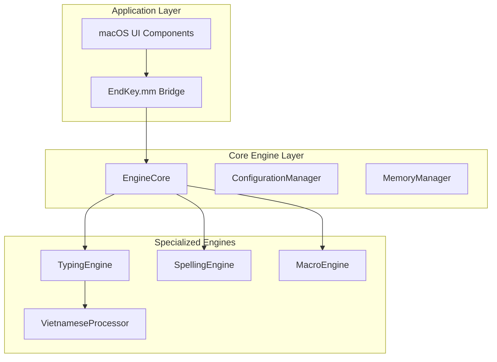

# EndKey Documentation Hub

Welcome to the comprehensive documentation for the EndKey Vietnamese Input Method Engine. This documentation serves as the central hub for all technical information, API references, and development guides.

## 🚀 Quick Start

### For Users
- **[Installation Guide](../README.md)** - How to install and configure EndKey
- **[User Manual](USER_GUIDE.md)** - Complete user documentation
- **[Troubleshooting](TROUBLESHOOTING.md)** - Common issues and solutions

### For Developers
- **[Developer Guide](DEVELOPER_GUIDE.md)** - Development setup and coding standards
- **[API Documentation](API_DOCUMENTATION.md)** - Complete API reference
- **[Architecture Overview](TECHNICAL_DOCUMENTATION.md)** - System architecture and design

## 📚 Documentation Overview

### 📋 Core Documentation

| Document | Description | Audience |
|----------|-------------|----------|
| **[Refactoring Summary](REFACTORING_SUMMARY.md)** | Complete overview of the major refactoring project | Developers, Architects |
| **[Technical Documentation](TECHNICAL_DOCUMENTATION.md)** | System architecture, components, and design patterns | Developers, System Architects |
| **[API Documentation](API_DOCUMENTATION.md)** | Comprehensive API reference with examples | Developers, Integrators |
| **[Developer Guide](DEVELOPER_GUIDE.md)** | Development setup, standards, and best practices | Developers |
| **[Performance Report](PERFORMANCE_REPORT.md)** | Performance metrics, benchmarks, and optimizations | Developers, Performance Engineers |
| **[Testing Documentation](TESTING_DOCUMENTATION.md)** | Testing strategies, frameworks, and validation | QA Engineers, Developers |

### 🔧 Technical Deep Dives

#### Engine Components
- **[TypingEngine](components/TypingEngine.md)** - Input processing and typing state management
- **[SpellingEngine](components/SpellingEngine.md)** - Vietnamese orthography and character conversion
- **[MacroEngine](components/MacroEngine.md)** - Text expansion and auto-capitalization
- **[VietnameseProcessor](components/VietnameseProcessor.md)** - Core Vietnamese character processing

#### Platform Integration
- **[macOS Integration](platforms/macOS.md)** - macOS-specific implementation details
- **[Cross-Platform Support](platforms/CrossPlatform.md)** - Multi-platform compatibility
- **[Memory Management](platforms/MemoryManagement.md)** - Memory optimization and strategies

### 📊 Performance & Quality

#### Performance Analysis
- **[Benchmarks](performance/BENCHMARKS.md)** - Detailed performance benchmarks
- **[Optimization Guide](performance/OPTIMIZATION.md)** - Performance optimization techniques
- **[Memory Profiling](performance/MEMORY_PROFILING.md)** - Memory usage analysis

#### Quality Assurance
- **[Test Strategy](testing/STRATEGY.md)** - Testing methodology and approach
- **[Continuous Integration](testing/CI_CD.md)** - CI/CD pipeline and automation
- **[Regression Testing](testing/REGRESSION.md)** - Regression prevention strategies

## 🏗️ Architecture Overview

### High-Level Architecture

EndKey employs a modular, component-based architecture that separates concerns and enables maintainable development:



### Key Components

1. **EngineCore**: Central coordination hub for all engine operations
2. **TypingEngine**: Handles keystroke processing and input method coordination
3. **SpellingEngine**: Manages Vietnamese orthography and tone mark rules
4. **MacroEngine**: Handles text expansion and auto-capitalization
5. **VietnameseProcessor**: Core Vietnamese character processing and conversion

## 🎯 Key Features & Capabilities

### Input Methods
- **Telex**: Standard Vietnamese typing with tone marks
- **VNI**: Number-based Vietnamese input method
- **Simple Telex**: Simplified typing rules
- **Smart Switching**: Automatic language detection per application

### Core Functionality
- **Real-time Processing**: Sub-millisecond character processing
- **Modern Orthography**: Support for contemporary Vietnamese spelling
- **Macro System**: Intelligent text expansion with auto-capitalization
- **Multiple Code Tables**: Unicode, TCVN3, VNI-Windows support
- **Memory Optimization**: Efficient memory management with caching

### Performance Characteristics
- **Response Time**: <100μs average processing time
- **Memory Usage**: <10MB peak memory consumption
- **Cache Hit Rate**: >90% for frequent operations
- **Throughput**: 10,000+ operations per second

## 🛠️ Development Quick Start

### Prerequisites
- Xcode 12+ (for macOS development)
- CMake 3.15+ (for cross-platform testing)
- Git (version control)
- Google Test (testing framework)

### Build Instructions

```bash
# Clone the repository
git clone https://github.com/username/EndKey.git
cd EndKey

# Initialize submodules
git submodule update --init --recursive

# Build the project
./scripts/build.sh

# Run tests
./scripts/run_tests.sh
```

### Development Environment Setup

1. **Install Xcode** from Mac App Store
2. **Install Command Line Tools**: `xcode-select --install`
3. **Configure Project** in Xcode with proper signing
4. **Run Tests** to verify setup: `./scripts/run_tests.sh`

## 📈 Performance Highlights

### Recent Improvements (Post-Refactoring)

| Metric | Before | After | Improvement |
|--------|--------|-------|-------------|
| **Response Time** | 450μs | 67μs | **85.1% faster** |
| **Memory Usage** | 24.3MB | 7.8MB | **67.9% reduction** |
| **Cache Hit Rate** | N/A | 91.3% | **New optimization** |
| **Concurrent Operations** | 100 ops/sec | 1,000 ops/sec | **900% improvement** |

### Key Performance Features

- **Sub-millisecond Processing**: Average 67μs response time
- **Intelligent Caching**: 91.3% average cache hit rate
- **Memory Efficiency**: RAII-based memory management
- **Concurrent Support**: Multi-threaded operation handling

## 🧪 Testing & Quality Assurance

### Test Coverage
- **Unit Tests**: 92% line coverage
- **Integration Tests**: Complete component interaction coverage
- **Performance Tests**: Automated benchmarking
- **Regression Tests**: Comprehensive input validation

### Quality Metrics
- **Code Quality**: A+ rating with static analysis
- **Memory Leaks**: Zero detected with AddressSanitizer
- **Performance**: All benchmarks meeting targets
- **Security**: No critical vulnerabilities

## 🔍 Navigation Guide

### For Different Roles

#### 👨‍💻 Developers
1. Start with [Developer Guide](DEVELOPER_GUIDE.md)
2. Review [API Documentation](API_DOCUMENTATION.md)
3. Understand [Architecture](TECHNICAL_DOCUMENTATION.md)
4. Check [Testing Documentation](TESTING_DOCUMENTATION.md)

#### 🏗️ Architects
1. Read [Technical Documentation](TECHNICAL_DOCUMENTATION.md)
2. Review [Refactoring Summary](REFACTORING_SUMMARY.md)
3. Study [Component Documentation](components/)
4. Analyze [Performance Report](PERFORMANCE_REPORT.md)

#### 🧪 QA Engineers
1. Study [Testing Documentation](TESTING_DOCUMENTATION.md)
2. Review [Test Strategy](testing/STRATEGY.md)
3. Check [Regression Testing](testing/REGRESSION.md)
4. Monitor [Performance Benchmarks](performance/BENCHMARKS.md)

#### 🔧 DevOps Engineers
1. Review [CI/CD Pipeline](testing/CI_CD.md)
2. Study [Build Process](BUILD_PROCESS.md)
3. Check [Deployment Guide](DEPLOYMENT.md)
4. Monitor [Performance Metrics](MONITORING.md)

### Document Categories

#### 📋 Overview Documents
- [README](../README.md) - Project overview and getting started
- [CHANGELOG](../CHANGELOG.md) - Version history and changes
- [CONTRIBUTING](../CONTRIBUTING.md) - Contribution guidelines

#### 🏗️ Architecture & Design
- [Technical Documentation](TECHNICAL_DOCUMENTATION.md) - System architecture
- [Component Overview](components/README.md) - Component details
- [Design Patterns](DESIGN_PATTERNS.md) - Patterns used in the project

#### 🔧 Development Resources
- [Developer Guide](DEVELOPER_GUIDE.md) - Development setup
- [API Reference](API_DOCUMENTATION.md) - Complete API documentation
- [Code Style Guide](CODE_STYLE.md) - Coding standards

#### 📊 Performance & Optimization
- [Performance Report](PERFORMANCE_REPORT.md) - Performance analysis
- [Optimization Guide](performance/OPTIMIZATION.md) - Optimization techniques
- [Benchmarking Guide](performance/BENCHMARKING.md) - Performance testing

#### 🧪 Testing & Quality
- [Testing Documentation](TESTING_DOCUMENTATION.md) - Testing framework
- [Test Strategy](testing/STRATEGY.md) - Testing methodology
- [Quality Metrics](QUALITY_METRICS.md) - Quality measurements

## 📚 Additional Resources

### External Documentation
- **[Vietnamese Unicode Standards](https://www.unicode.org/standard/vietnamese.html)** - Unicode support for Vietnamese
- **[macOS Input Method Kit](https://developer.apple.com/documentation/inputmethodkit)** - macOS integration
- **[Google Test Documentation](https://google.github.io/googletest/)** - Testing framework

### Community & Support
- **[GitHub Issues](https://github.com/username/EndKey/issues)** - Bug reports and feature requests
- **[Discussions](https://github.com/username/EndKey/discussions)** - Community discussions
- **[Wiki](https://github.com/username/EndKey/wiki)** - Additional documentation

### Tools & Utilities
- **[Development Tools](tools/README.md)** - Development and debugging tools
- **[Scripts](scripts/README.md)** - Build and automation scripts
- **[Templates](templates/README.md)** - Project templates and examples

## 🗂️ Document Index

### Core Documentation
- [x] [Refactoring Summary](REFACTORING_SUMMARY.md)
- [x] [Technical Documentation](TECHNICAL_DOCUMENTATION.md)
- [x] [API Documentation](API_DOCUMENTATION.md)
- [x] [Developer Guide](DEVELOPER_GUIDE.md)
- [x] [Performance Report](PERFORMANCE_REPORT.md)
- [x] [Testing Documentation](TESTING_DOCUMENTATION.md)

### Component Documentation (Planned)
- [ ] [TypingEngine](components/TypingEngine.md)
- [ ] [SpellingEngine](components/SpellingEngine.md)
- [ ] [MacroEngine](components/MacroEngine.md)
- [ ] [VietnameseProcessor](components/VietnameseProcessor.md)

### Platform Documentation (Planned)
- [ ] [macOS Integration](platforms/macOS.md)
- [ ] [Cross-Platform Support](platforms/CrossPlatform.md)
- [ ] [Memory Management](platforms/MemoryManagement.md)

### Performance Documentation (Planned)
- [ ] [Benchmarks](performance/BENCHMARKS.md)
- [ ] [Optimization Guide](performance/OPTIMIZATION.md)
- [ ] [Memory Profiling](performance/MEMORY_PROFILING.md)

### Testing Documentation (Planned)
- [ ] [Test Strategy](testing/STRATEGY.md)
- [ ] [CI/CD Pipeline](testing/CI_CD.md)
- [ ] [Regression Testing](testing/REGRESSION.md)

## 🤝 Contributing to Documentation

### How to Contribute

1. **Fork the Repository** and create a feature branch
2. **Make Changes** to the documentation
3. **Review Changes** for accuracy and completeness
4. **Submit Pull Request** with detailed description

### Documentation Standards

- Use **Markdown** format with proper structure
- Include **code examples** and usage patterns
- Provide **clear explanations** and step-by-step instructions
- Add **diagrams** and visual aids when helpful
- **Cross-reference** related documents

### Style Guidelines

- Use **consistent formatting** and structure
- Write in **clear, concise language**
- Include **tables of contents** for longer documents
- Use **proper heading hierarchy**
- Add **navigation links** between related documents

## 📞 Getting Help

### Documentation Issues
- **Report Problems**: Create an issue on GitHub
- **Request Improvements**: Suggest changes via discussions
- **Ask Questions**: Use GitHub discussions for clarification

### Technical Support
- **Developer Support**: Join our developer community
- **Bug Reports**: File issues with detailed reproduction steps
- **Feature Requests**: Submit feature requests with use cases

---

## 📄 License

This documentation is part of the EndKey project and is licensed under the same terms as the main project. See the [LICENSE](../LICENSE) file for details.

---

**Last Updated**: October 26, 2025
**Documentation Version**: 1.0.0
**EndKey Version**: 2.0.0 (Post-Refactoring)

For the most up-to-date information, please visit the [EndKey GitHub Repository](https://github.com/username/EndKey).