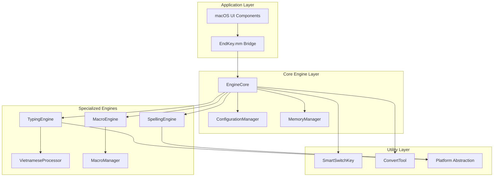
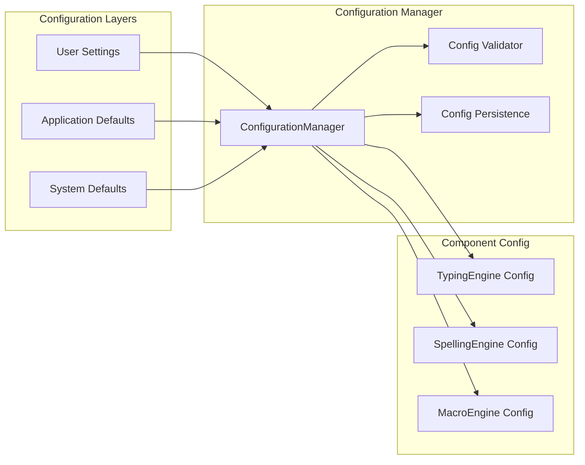
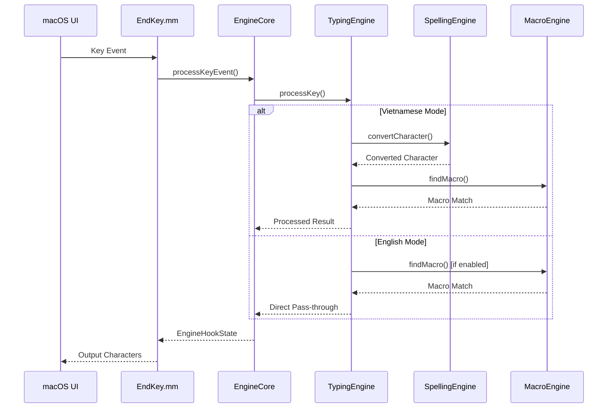
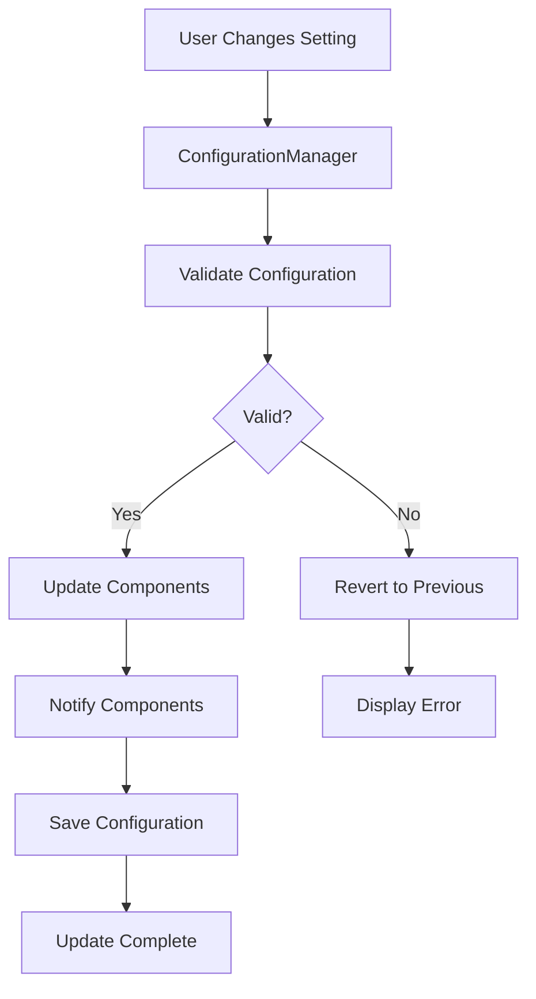
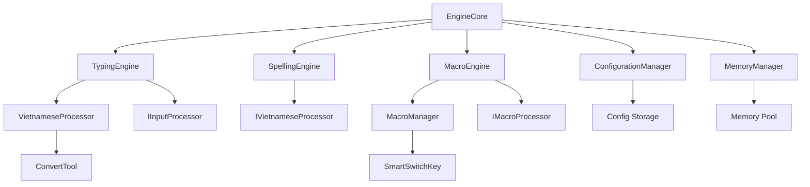

# EndKey Technical Documentation

## Table of Contents
1. [Architecture Overview](#architecture-overview)
2. [Component Architecture](#component-architecture)
3. [System Design](#system-design)
4. [Data Flow](#data-flow)
5. [Component Interactions](#component-interactions)
6. [Configuration Management](#configuration-management)
7. [Memory Management](#memory-management)
8. [Performance Optimization](#performance-optimization)

## Architecture Overview

### High-Level Architecture

EndKey employs a **modular, component-based architecture** that separates concerns and enables maintainable development. The system is built around a central **EngineCore** that coordinates specialized engines for different aspects of Vietnamese input processing.



### Design Principles

1. **Single Responsibility**: Each component has a focused purpose
2. **Open/Closed**: Components are open for extension, closed for modification
3. **Dependency Inversion**: High-level modules don't depend on low-level modules
4. **Interface Segregation**: Clients depend only on interfaces they use
5. **Don't Repeat Yourself**: Common functionality is abstracted and reused

## Component Architecture

### EngineCore - Central Coordinator

**Purpose**: Main coordination hub for all engine operations

**Responsibilities**:
- Initialize and manage component lifecycle
- Coordinate event processing between engines
- Manage engine state and configuration
- Provide unified API for external interfaces
- Handle performance monitoring

**Key Methods**:
```cpp
class EngineCore {
public:
    bool initialize(const EngineConfig& config);
    EngineHookState processKeyEvent(...);
    void startNewSession();
    void updateConfig(const EngineConfig& config);
    VietnameseProcessor& getVietnameseProcessor();
    MacroManager& getMacroManager();
};
```

### TypingEngine - Input Processing

**Purpose**: Handle keystroke processing and typing state management

**Responsibilities**:
- Process individual key events
- Maintain typing state and buffers
- Manage input method switching
- Handle character code mappings
- Optimize memory usage for long typing sessions

**Configuration**:
```cpp
struct InputConfig {
    int inputType;      // Telex, VNI, Simple Telex
    int language;       // English, Vietnamese
    int codeTable;      // Unicode, TCVN3, VNI-Windows
    bool freeMark;
    bool checkSpelling;
    bool useModernOrthography;
};
```

### SpellingEngine - Vietnamese Orthography

**Purpose**: Handle Vietnamese spelling rules and character conversion

**Responsibilities**:
- Validate Vietnamese word spelling
- Apply tone marks and diacritics
- Handle modern orthography rules
- Manage consonant/vowel classification
- Provide character conversion optimization

**Caching Strategy**:
```cpp
// Performance-optimized caching
mutable std::unordered_map<Uint64, bool> wordValidityCache_;
mutable std::unordered_map<Uint32, ToneMarkInfo> toneMarkCache_;
static constexpr size_t MAX_CACHE_SIZE = 10000;
```

### MacroEngine - Text Expansion

**Purpose**: Handle macro expansion and auto-capitalization

**Responsibilities**:
- Efficient macro lookup and matching
- Auto-capitalization with pattern learning
- Trie-based prefix searching
- Performance statistics tracking
- Memory-optimized macro storage

**Trie Structure**:
```cpp
struct TrieNode {
    std::unordered_map<char, std::unique_ptr<TrieNode>> children;
    MacroEntry* macroEntry = nullptr;
    bool isEndOfWord = false;
};
```

### VietnameseProcessor - Character Conversion

**Purpose**: Core Vietnamese character processing and conversion

**Responsibilities**:
- Convert between Vietnamese character encodings
- Handle tone mark application
- Process diacritic combinations
- Optimize character lookup tables
- Support multiple code tables

### MemoryManager - Resource Optimization

**Purpose**: Manage memory allocation and optimization

**Responsibilities**:
- Track memory usage across components
- Implement memory pooling strategies
- Handle garbage collection for cached data
- Optimize memory layout for performance
- Provide memory usage statistics

## System Design

### Configuration Architecture

**Hierarchical Configuration Management**:



### State Management

**Engine State Hierarchy**:

```cpp
// Global engine state
struct EngineState {
    std::vector<Uint32> typingWord;
    std::vector<std::vector<Uint32>> typingStates;
    size_t currentIndex;
    bool isInVietnameseMode;
    bool isTemporarilyOff;
    // ... other state fields
};

// Component-specific states
struct TypingState {
    std::vector<Uint32> typingWord;
    std::vector<Uint32> longWordHelper;
    Uint8 index;
    bool isActive;
};

struct SpellingState {
    bool tempOffSpelling;
    bool checkSpelling;
    bool useModernOrthography;
};
```

## Data Flow

### Event Processing Flow



### Configuration Update Flow



## Component Interactions

### Interface-Based Communication

**Core Interfaces**:

```cpp
// Input processing interface
class IInputProcessor {
public:
    virtual ~IInputProcessor() = default;
    virtual void processKey(const vKeyEvent& event, ...) = 0;
    virtual void reset() = 0;
    virtual bool isInitialized() const = 0;
};

// Vietnamese processing interface
class IVietnameseProcessor {
public:
    virtual ~IVietnameseProcessor() = default;
    virtual Uint16 convertCharacter(Uint16 input, Uint8 toneType) = 0;
    virtual bool isValidVietnameseWord(const std::vector<Uint16>& word) = 0;
};

// Macro processing interface
class IMacroProcessor {
public:
    virtual ~IMacroProcessor() = default;
    virtual MacroMatch findMacro(const std::string& input) = 0;
    virtual void addMacro(const std::string& keyword, const std::string& expansion) = 0;
};
```

### Component Dependency Graph



## Configuration Management

### Configuration Structure

**Master Configuration**:

```cpp
struct EngineConfig {
    // Input method settings
    int language;                    // 0: English, 1: Vietnamese
    int inputType;                   // 0: Telex, 1: VNI
    int codeTable;                   // 0: Unicode, 1: TCVN3, 2: VNI-Windows

    // Spelling settings
    int checkSpelling;               // 0: No, 1: Yes
    int useModernOrthography;        // 0: No, 1: Yes
    int allowConsonantZFWJ;          // 0: No, 1: Yes

    // Macro settings
    int useMacro;                    // 0: No, 1: Yes
    int useMacroInEnglishMode;       // 0: No, 1: Yes
    int autoCapsMacro;               // 0: No, 1: Yes

    // Interface settings
    int useSmartSwitchKey;           // 0: No, 1: Yes
    int upperCaseFirstChar;          // 0: No, 1: Yes
    int doubleSpacePeriod;           // 0: No, 1: Yes
};
```

### Configuration Validation

**Validation Rules**:
- Range checking for integer values
- Dependency validation between settings
- Compatibility checks for feature combinations
- Performance impact assessment

**Validation Process**:
```cpp
bool validateConfig(const EngineConfig& config) {
    // Validate input type range
    if (config.inputType < 0 || config.inputType > 2) {
        return false;
    }

    // Validate code table compatibility
    if (config.codeTable < 0 || config.codeTable > 2) {
        return false;
    }

    // Check feature dependencies
    if (config.useMacro && !validateMacroSettings(config)) {
        return false;
    }

    return true;
}
```

## Memory Management

### RAII Implementation

**Smart Pointer Usage**:
```cpp
class EngineCore {
private:
    struct Impl;
    std::unique_ptr<Impl> pImpl;  // Pimpl pattern with RAII

public:
    EngineCore() : pImpl(std::make_unique<Impl>()) {}
    ~EngineCore() = default;  // Automatic cleanup
};
```

### Memory Optimization Strategies

**1. Object Pooling**:
```cpp
class MemoryPool {
private:
    std::vector<std::unique_ptr<uint8_t[]>> pools_;
    std::queue<uint8_t*> available_;

public:
    uint8_t* allocate(size_t size);
    void deallocate(uint8_t* ptr);
};
```

**2. Cache Management**:
```cpp
template<typename Key, typename Value>
class LRUCache {
private:
    size_t maxSize_;
    std::unordered_map<Key, std::list<std::pair<Key, Value>>::iterator> cache_;
    std::list<std::pair<Key, Value>> usageOrder_;

public:
    Value get(const Key& key);
    void put(const Key& key, const Value& value);
    void evictOldest();
};
```

**3. Memory Usage Tracking**:
```cpp
struct MemoryStats {
    size_t totalAllocated = 0;
    size_t peakUsage = 0;
    size_t cacheSize = 0;
    size_t componentUsage[MAX_COMPONENTS];
};
```

## Performance Optimization

### Caching Strategies

**1. Character Conversion Cache**:
- Pre-computed Vietnamese character mappings
- Hash-based lookup with O(1) complexity
- LRU eviction for memory management

**2. Word Validation Cache**:
- Cached spelling check results
- Trie-based word validation
- Configurable cache size based on available memory

**3. Macro Lookup Optimization**:
- Trie structure for prefix matching
- Frequency-based ordering
- Cache recent macro expansions

### Performance Monitoring

**Metrics Collection**:
```cpp
struct PerformanceMetrics {
    uint64_t totalEvents = 0;
    uint64_t totalProcessTime = 0;
    uint64_t averageProcessTime = 0;
    uint64_t peakProcessTime = 0;

    size_t cacheHits = 0;
    size_t cacheMisses = 0;
    double cacheHitRatio = 0.0;

    size_t memoryUsage = 0;
    size_t peakMemoryUsage = 0;
};
```

**Benchmarking Framework**:
```cpp
class PerformanceBenchmark {
public:
    void startMeasurement(const std::string& operation);
    void endMeasurement(const std::string& operation);
    void recordMetric(const std::string& name, uint64_t value);
    PerformanceReport generateReport() const;
};
```

### Optimization Techniques

**1. Lazy Loading**:
- Character tables loaded on demand
- Component initialization deferred until needed
- Memory allocation only when required

**2. Batch Processing**:
- Process multiple characters together
- Reduce system call overhead
- Optimize memory access patterns

**3. Memory Pre-allocation**:
- Pre-allocate buffers for common operations
- Reduce dynamic allocation overhead
- Improve cache locality

## Platform Abstraction

### Cross-Platform Design

**Platform Interface**:
```cpp
#ifdef _WIN32
    #include "platforms/win32.h"
#elif defined(__APPLE__)
    #include "platforms/mac.h"
#elif defined(__linux__)
    #include "platforms/linux.h"
#endif

class PlatformInterface {
public:
    virtual void* allocateMemory(size_t size) = 0;
    virtual void deallocateMemory(void* ptr) = 0;
    virtual uint64_t getCurrentTime() = 0;
    virtual void logMessage(const std::string& message) = 0;
};
```

### macOS Integration

**Cocoa Integration**:
```objc
@interface EndKeyBridge : NSObject
- (void)processKeyEvent:(NSEvent *)event;
- (void)updateConfiguration:(EngineConfig)config;
- (EngineConfig)getCurrentConfiguration;
@end
```

This technical documentation provides a comprehensive overview of the EndKey refactored architecture, serving as a reference for developers working on the Vietnamese input method engine.